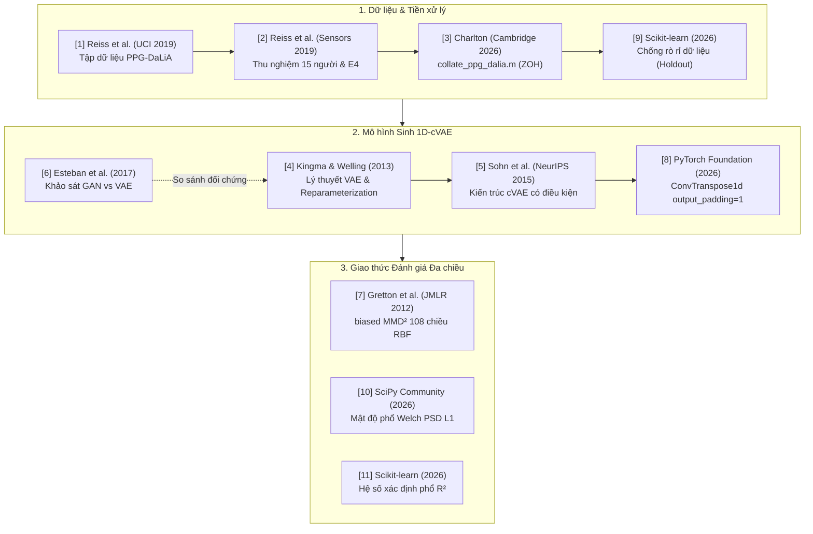

# TÀI LIỆU THAM KHẢO & BẢNG ĐỐI CHIẾU TRÍCH DẪN KHOA HỌC
## (Academic References & In-Text Citation Mapping)

> **Đồ án Cuối kỳ:** Tăng cường Dữ liệu Chuỗi Thời gian Gia tốc Cổ tay bằng Mạng Sinh Biến phân có Điều kiện (1D-cVAE) cho Nhận diện Hoạt động Người (HAR) trên tập dữ liệu PPG-DaLiA  
> **Sinh viên thực hiện:** Nguyễn Bách Tùng — MSSV: 23110166  
> **Khoa:** Công nghệ Thông tin | **Học phần:** Trí tuệ Nhân tạo cho IoT (AIoT)  
> **Kho lưu trữ GitHub:** [23110166-tung/FINAL_TTNT_IOT](https://github.com/23110166-tung/FINAL_TTNT_IOT)

---

## 1. Danh mục Tài liệu Tham khảo Chuẩn Học thuật (IEEE Format)

| Mã | Trích dẫn đầy đủ (IEEE Citation Format) | Loại tài liệu | Liên kết Gốc | Tệp Minh chứng Lưu trữ (`tai_lieu_tham_khao/`) |
| :---: | :--- | :---: | :---: | :--- |
| **[1]** | A. Reiss, I. Indlekofer, and P. Schmidt, *"PPG-DaLiA,"* UCI Machine Learning Repository, 2019. | Benchmark Dataset | [DOI: 10.24432/C53890](https://doi.org/10.24432/C53890) | [[01] Tài liệu PPG-DaLiA (PDF)](tai_lieu_tham_khao/[01]_UCI_PPG_DaLiA_Dataset_Documentation.pdf) \| [HTML](tai_lieu_tham_khao/[01]_UCI_PPG_DaLiA_Dataset_Documentation.html) |
| **[2]** | A. Reiss, I. Indlekofer, P. Schmidt, and K. Van Laerhoven, *"Deep PPG: Large-Scale Heart Rate Estimation with Convolutional Neural Networks,"* *Sensors*, vol. 19, no. 14, p. 3079, 2019. | Journal Paper (MDPI) | [DOI: 10.3390/s19143079](https://doi.org/10.3390/s19143079) | [[02] Bài báo Reiss 2019 (PDF)](tai_lieu_tham_khao/[02]_Reiss2019_Deep_PPG_Sensors.pdf) \| [HTML](tai_lieu_tham_khao/[02]_Reiss2019_Deep_PPG_Sensors_FullText.html) \| [XML](tai_lieu_tham_khao/[02]_Reiss2019_Deep_PPG_Sensors_JATS.xml) |
| **[3]** | P. H. Charlton, *"collate_ppg_dalia_dataset.m: MATLAB Data Collation Script for PPG-DaLiA Dataset,"* Department of Public Health and Primary Care, University of Cambridge, 2026. | Data Processing Script | [GitHub / Charlton Lab](https://github.com/peterhcharlton/ppg-dalia-dataset) | [[03] Mã MATLAB](tai_lieu_tham_khao/[03]_Charlton2026_collate_ppg_dalia_dataset.m) \| [Mã Python](tai_lieu_tham_khao/[03]_Charlton2026_convert_subject_pickle_files_to_mat.py) \| [Tài liệu (PDF)](tai_lieu_tham_khao/[03]_Charlton2026_Script_Documentation.pdf) |
| **[4]** | D. P. Kingma and M. Welling, *"Auto-Encoding Variational Bayes,"* in *Proceedings of the 2nd International Conference on Learning Representations (ICLR)*, arXiv:1312.6114, 2013. | Conference Paper (ICLR) | [arXiv:1312.6114](https://arxiv.org/abs/1312.6114) | [[04] Bài báo Kingma VAE (PDF)](tai_lieu_tham_khao/[04]_Kingma2013_Auto_Encoding_Variational_Bayes_ICLR.pdf) |
| **[5]** | K. Sohn, H. Lee, and X. Yan, *"Learning Structured Output Representation using Deep Conditional Generative Models,"* in *Advances in Neural Information Processing Systems (NeurIPS)*, vol. 28, pp. 3483–3491, 2015. | Conference Paper (NeurIPS) | [NeurIPS Proceedings](https://papers.nips.cc/paper/2015/hash/8d55a9e3e7acd218d61b923baf54b1f4-Abstract.html) | [[05] Bài báo Sohn cVAE (PDF)](tai_lieu_tham_khao/[05]_Sohn2015_Learning_Structured_Output_Representation_cVAE_NeurIPS.pdf) |
| **[6]** | C. Esteban, S. L. Hyland, and G. Rätsch, *"Real-valued (Medical) Time Series Generation with Recurrent Conditional GANs,"* arXiv preprint arXiv:1706.02633, 2017. | Pre-print (RCGAN) | [arXiv:1706.02633](https://arxiv.org/abs/1706.02633) | [[06] Bài báo Esteban RCGAN (PDF)](tai_lieu_tham_khao/[06]_Esteban2017_Medical_Time_Series_RCGAN.pdf) |
| **[7]** | A. Gretton, K. M. Borgwardt, M. J. Rasch, B. Schölkopf, and A. Smola, *"A Kernel Two-Sample Test,"* *Journal of Machine Learning Research (JMLR)*, vol. 13, pp. 723–773, 2012. | Journal Paper (JMLR) | [JMLR Publication](https://jmlr.org/papers/v13/gretton12a.html) | [[07] Bài báo Gretton MMD (PDF)](tai_lieu_tham_khao/[07]_Gretton2012_Kernel_Two_Sample_Test_MMD_JMLR.pdf) |
| **[8]** | PyTorch Foundation, *"ConvTranspose1d Module Documentation,"* PyTorch Official API Reference, v2.5, 2026. | Technical Documentation | [PyTorch Docs](https://pytorch.org/docs/stable/generated/torch.nn.ConvTranspose1d.html) | [[08] Tài liệu ConvTranspose1d (PDF)](tai_lieu_tham_khao/[08]_PyTorch_ConvTranspose1d_Official_Documentation.pdf) \| [HTML](tai_lieu_tham_khao/[08]_PyTorch_ConvTranspose1d_Official_Documentation.html) |
| **[9]** | Scikit-learn Developers, *"Common pitfalls and recommended practices in data preprocessing (Data Leakage Avoidance),"* scikit-learn documentation, v1.5, 2026. | Technical Documentation | [Scikit-learn Pitfalls](https://scikit-learn.org/stable/common_pitfalls.html) | [[09] Hướng dẫn Data Leakage (PDF)](tai_lieu_tham_khao/[09]_ScikitLearn_Data_Leakage_Preprocessing_Pitfalls.pdf) \| [HTML](tai_lieu_tham_khao/[09]_ScikitLearn_Data_Leakage_Preprocessing_Pitfalls.html) |
| **[10]** | SciPy Community, *"scipy.signal.welch: Estimation of power spectral density using Welch method,"* SciPy Reference Guide, v1.14, 2026. | Technical Documentation | [SciPy Signal Welch](https://docs.scipy.org/doc/scipy/reference/generated/scipy.signal.welch.html) | [[10] Tài liệu SciPy Welch (PDF)](tai_lieu_tham_khao/[10]_SciPy_Signal_Welch_PSD_Official_Documentation.pdf) \| [HTML](tai_lieu_tham_khao/[10]_SciPy_Signal_Welch_PSD_Official_Documentation.html) |
| **[11]** | Scikit-learn Developers, *"r2_score: Coefficient of determination regression score,"* scikit-learn documentation, v1.5, 2026. | Technical Documentation | [Scikit-learn R2 Score](https://scikit-learn.org/stable/modules/generated/sklearn.metrics.r2_score.html) | [[11] Tài liệu R2 Score (PDF)](tai_lieu_tham_khao/[11]_ScikitLearn_R2_Score_Official_Documentation.pdf) \| [HTML](tai_lieu_tham_khao/[11]_ScikitLearn_R2_Score_Official_Documentation.html) |

---

## 2. Bảng Đối chiếu Chi tiết Vị trí Trích dẫn trong Báo cáo Đồ án (DOCX)

Bảng dưới đây ánh xạ chi tiết vị trí trang, số mục, câu văn ngữ cảnh và đóng góp khoa học của từng tài liệu tham khảo trong file báo cáo chính thức `NguyenBachTung_BaoCao_CuoiKy.docx`:

| Mã | Tài liệu tham khảo | Vị trí xuất hiện trong bài | Ngữ cảnh trích dẫn trong văn bản báo cáo | Vai trò khoa học / Đóng góp cho đề tài |
| :---: | :--- | :--- | :--- | :--- |
| **[1]** | A. Reiss et al. (2019) | **Mục 2.1 (Trang 4)** | *"...được công bố bởi nhóm nghiên cứu của Reiss và các cộng sự vào năm 2019 (Sensors, 2019 [2] / UCI Machine Learning Repository [1])."* | Căn cứ pháp lý và nguồn tải benchmark dữ liệu gia tốc cổ tay 3 trục PPG-DaLiA chuẩn quốc tế. |
| **[2]** | A. Reiss et al. (2019) | **Mục 2.1 (Trang 4)** | *"...được công bố bởi nhóm nghiên cứu của Reiss và các cộng sự vào năm 2019 (Sensors, 2019 [2] / UCI Machine Learning Repository [1])."* | Công bố gốc mô tả quy trình thu nghiệm thực tế trên 15 đối tượng, thiết bị đo Empatica E4 và 8 danh mục hoạt động thường nhật. |
| **[3]** | P. H. Charlton (2026) | **Mục 2.2 (Trang 4)** | *"...việc đối chiếu kỹ lưỡng cấu trúc tệp dữ liệu gốc và mã nguồn collate_ppg_dalia_dataset.m của tác giả Charlton [3]."* | Căn cứ phản biện khoa học phân biệt rạch ròi: trường `activity` (4 Hz) là nhãn HAR, còn trường `label` (0.5 Hz) là nhịp tim ECG. |
| **[4]** | D. P. Kingma & M. Welling (2013) | **Mục 3.2 & Mục 3.4 (Trang 8, 9)** | *"Mô hình VAE truyền thống (Kingma & Welling, 2013 [4])..."* và *"Để khắc phục điều này, Kingma & Welling [4] đề xuất thủ thuật tái tham số hóa (reparameterization trick)..."* | Nền tảng lý thuyết mạng tự mã hóa biến phân (VAE) và kỹ thuật reparameterization trick $z = \mu + \sigma \odot \epsilon$ cho phép lan truyền ngược gradient. |
| **[5]** | K. Sohn et al. (2015) | **Mục 3.2 (Trang 8)** | *"Mô hình cVAE (Sohn et al., NeurIPS 2015 [5]) giải quyết bài toán này bằng cách điều kiện hóa cả bộ mã hóa và bộ giải mã theo nhãn c."* | Cơ sở xây dựng mạng sinh có điều kiện (cVAE), giải quyết bài toán điều khiển sinh mẫu chính xác theo lớp hoạt động chỉ định. |
| **[6]** | C. Esteban et al. (2017) | **Mục 1.3 (Trang 2)** | *"...mạng đối nghịch tạo sinh (generative adversarial networks – GAN [6]) và mạng tự mã hóa biến phân (variational autoencoders – VAE)..."* | Luận chứng so sánh vì sao chọn cVAE thay vì GAN (tránh hiện tượng mode collapse và bất ổn định khi sinh chuỗi thời gian y sinh). |
| **[7]** | A. Gretton et al. (2012) | **Mục 4.4 (Trang 14)** | *"4. Khoảng cách phân phối biased MMD² (108 chiều) [7]: Đo lường sự sai khác phân phối xác suất giữa tập kiểm định thật và tập dữ liệu sinh nhân tạo."* | Cơ sở toán học của thước đo Maximum Mean Discrepancy (MMD) trên không gian Hilbert tái tạo (RKHS) đa băng thông RBF. |
| **[8]** | PyTorch Foundation (2026) | **Mục 3.5 (Trang 9)** | *"Theo tài liệu chính thức của PyTorch [8], công thức tính chiều dài đầu ra của tầng ConvTranspose1d là..."* | Công thức giải tích chứng minh bắt buộc phải cấu hình `output_padding=1` ở cả 4 tầng giải mã để khôi phục đúng 128 mẫu (4.0s). |
| **[9]** | Scikit-learn Developers (2026) | **Mục 2.5 (Trang 5)** | *"2.5. Chiến lược chia tập theo đối tượng và chuẩn hóa chống rò rỉ dữ liệu [9]"* | Hướng dẫn thực hành chuẩn mực về chống rò rỉ dữ liệu (data leakage avoidance): fit Z-score scaler độc quyền trên Train S1–S11. |
| **[10]** | SciPy Community (2026) | **Mục 4.4 (Trang 14)** | *"5. Khoảng cách hình dạng phổ Welch (d_PSD): Ước lượng mật độ phổ công suất bằng phương pháp Welch [10] (fs = 32 Hz, cửa sổ Hann tuần hoàn 64 điểm)..."* | Tiêu chuẩn ước lượng mật độ phổ công suất (Welch PSD) với cửa sổ Hann phân đoạn, giảm phương sai ước lượng phổ gia tốc. |
| **[11]** | Scikit-learn Developers (2026) | **Mục 5.3 (Trang 17)** | *"...khoảng cách hình dạng phổ Welch L1 (d_PSD), hệ số xác định phổ R² [11] và công suất trung bình tín hiệu theo từng lớp."* | Thước đo hệ số xác định ($R^2$) đánh giá định lượng độ tương đồng hình dạng phổ tần số giữa tín hiệu cVAE và tín hiệu người thật. |

---

## 3. Bản đồ Mối liên kết Khoa học của các Tài liệu Tham khảo



---

## 4. Danh mục Trích dẫn Dạng BibTeX (BibTeX Bibliography)

Dành cho các nhà nghiên cứu và người đọc muốn trích dẫn lại đề tài hoặc các công trình liên quan:

```bibtex
@article{reiss2019dalia,
  author    = {Attila Reiss and Ina Indlekofer and Philip Schmidt and Kristof Van Laerhoven},
  title     = {Deep PPG: Large-Scale Heart Rate Estimation with Convolutional Neural Networks},
  journal   = {Sensors},
  volume    = {19},
  number    = {14},
  pages     = {3079},
  year      = {2019},
  doi       = {10.3390/s19143079}
}

@misc{reiss2019ucidalia,
  author    = {Attila Reiss and Ina Indlekofer and Philip Schmidt},
  title     = {PPG-DaLiA Dataset},
  year      = {2019},
  howpublished = {UCI Machine Learning Repository},
  doi       = {10.24432/C53890}
}

@misc{charlton2026dalia,
  author    = {Peter H. Charlton},
  title     = {collate\_ppg\_dalia\_dataset.m: MATLAB data collation script for PPG-DaLiA dataset},
  year      = {2026},
  url       = {https://github.com/peterhcharlton/ppg-dalia-dataset}
}

@inproceedings{kingma2013auto,
  author    = {Diederik P. Kingma and Max Welling},
  title     = {Auto-Encoding Variational Bayes},
  booktitle = {Proceedings of the 2nd International Conference on Learning Representations (ICLR)},
  year      = {2013},
  eprint    = {1312.6114},
  archivePrefix = {arXiv}
}

@inproceedings{sohn2015learning,
  author    = {Kihyuk Sohn and Honglak Lee and Xinchen Yan},
  title     = {Learning Structured Output Representation using Deep Conditional Generative Models},
  booktitle = {Advances in Neural Information Processing Systems (NeurIPS)},
  volume    = {28},
  pages     = {3483--3491},
  year      = {2015}
}

@article{esteban2017real,
  author    = {Crist{\'o}bal Esteban and Stephanie L. Hyland and Gunnar R{\"a}tsch},
  title     = {Real-valued (Medical) Time Series Generation with Recurrent Conditional GANs},
  journal   = {arXiv preprint arXiv:1706.02633},
  year      = {2017},
  doi       = {10.48550/arXiv.1706.02633}
}

@article{gretton2012kernel,
  author    = {Arthur Gretton and Karsten M. Borgwardt and Malte J. Rasch and Bernhard Sch{\"o}lkopf and Alexander Smola},
  title     = {A Kernel Two-Sample Test},
  journal   = {Journal of Machine Learning Research (JMLR)},
  volume    = {13},
  pages     = {723--773},
  year      = {2012}
}

@manual{pytorch2026convtranspose,
  title     = {ConvTranspose1d Module Documentation},
  author    = {{PyTorch Foundation}},
  year      = {2026},
  note      = {Version 2.5},
  url       = {https://pytorch.org/docs/stable/generated/torch.nn.ConvTranspose1d.html}
}

@manual{sklearn2026pitfalls,
  title     = {Common pitfalls and recommended practices in data preprocessing},
  author    = {{Scikit-learn Developers}},
  year      = {2026},
  note      = {Version 1.5},
  url       = {https://scikit-learn.org/stable/common_pitfalls.html}
}

@manual{scipy2026welch,
  title     = {scipy.signal.welch: Estimation of power spectral density using Welch method},
  author    = {{SciPy Community}},
  year      = {2026},
  note      = {Version 1.14},
  url       = {https://docs.scipy.org/doc/scipy/reference/generated/scipy.signal.welch.html}
}

@manual{sklearn2026r2score,
  title     = {r2\_score: Coefficient of determination},
  author    = {{Scikit-learn Developers}},
  year      = {2026},
  note      = {Version 1.5},
  url       = {https://scikit-learn.org/stable/modules/generated/sklearn.metrics.r2_score.html}
}
```
